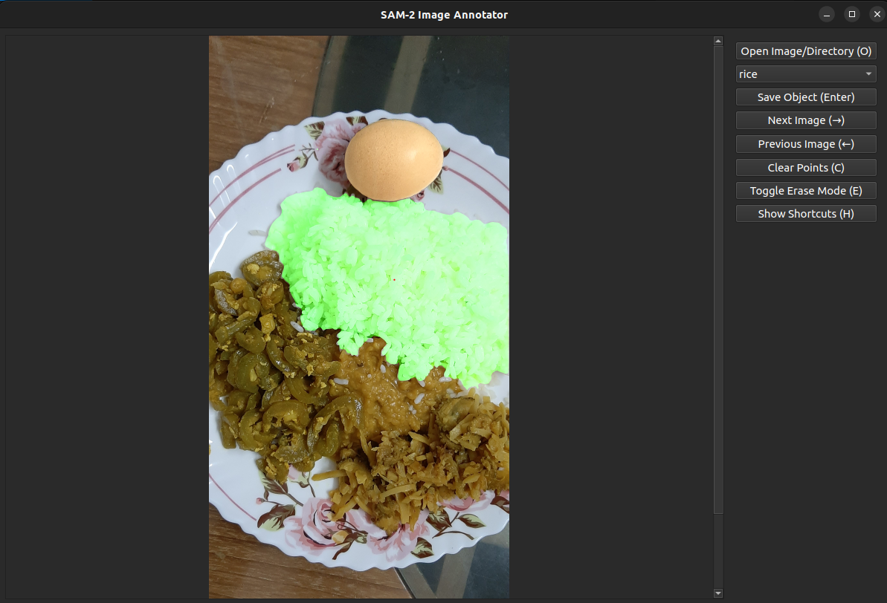

# SAM Image Annotator Plus

A powerful and user-friendly image annotation tool built on Meta's Segment Anything Model (SAM). Designed with extra functionality for efficient manual corrections, polygon-based annotations, and easy dataset generation. Ideal for tasks such as object segmentation, dataset labeling, and computer vision projects.

## ✨ Features

✅ Interactive annotation using Segment Anything Model (SAM)

✅ Manual point-based correction (foreground/background)

✅ Zoom, pan, undo/redo functionality

✅ Annotations saved as simplified polygon coordinates in JSON

✅ Automatically reloads saved annotations

✅ Supports mask-to-polygon conversion using OpenCV

✅ Minimal UI with scrollable image view
## 🛠 Technologies Used
### Python

### PyQt6 — for GUI

### OpenCV — for image processing and mask handling

## 📁 File Structure
image_annotator.py — main GUI-based annotation script

## 🖼️ Example Annotation
An example of annotated data can be found at:

## ▶️ Usage
### Install the dependencies:
pip install -r requirements.txt

### 💡 Notes

Labels are saved per image in a labels/ folder.

Each label JSON file contains a list of polygons with associated object metadata.

 
